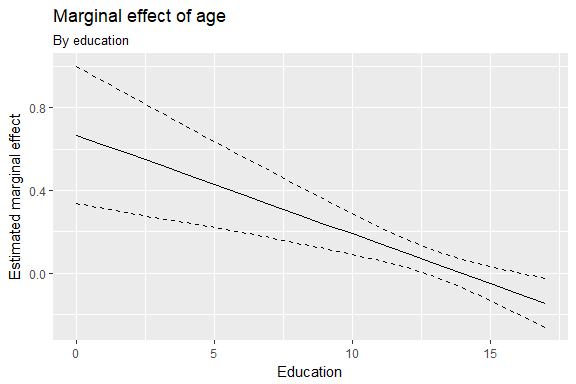
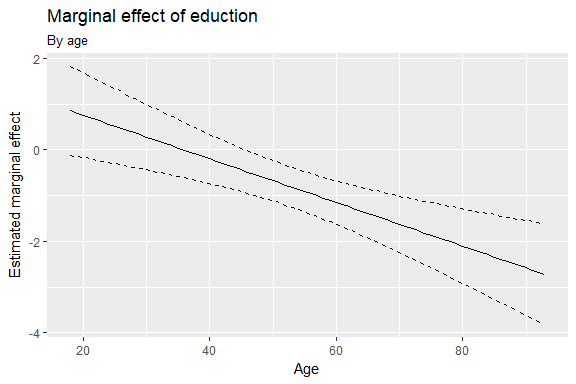

R code
================
Kanyao Han

``` r
library(tidyverse)
```

    ## -- Attaching packages ----------------------------------------------------------------- tidyverse 1.2.1 --

    ## v ggplot2 2.2.1     v purrr   0.2.4
    ## v tibble  1.3.4     v dplyr   0.7.4
    ## v tidyr   0.7.2     v stringr 1.3.0
    ## v readr   1.1.1     v forcats 0.2.0

    ## Warning: package 'stringr' was built under R version 3.4.3

    ## -- Conflicts -------------------------------------------------------------------- tidyverse_conflicts() --
    ## x dplyr::filter() masks stats::filter()
    ## x dplyr::lag()    masks stats::lag()

``` r
library(car)
```

    ## 
    ## Attaching package: 'car'

    ## The following object is masked from 'package:dplyr':
    ## 
    ##     recode

    ## The following object is masked from 'package:purrr':
    ## 
    ##     some

``` r
biden <- read.csv("C:/Users/hankanyao/Desktop/python/biden.csv")
```

``` r
# function to get point estimates and standard errors
# model - lm object
# mod_var - name of moderating variable in the interaction
instant_effect <- function(model, mod_var){
  # get interaction term name
  int.name <- names(model$coefficients)[[which(str_detect(names(model$coefficients), ":"))]]
  
  marg_var <- str_split(int.name, ":")[[1]][[which(str_split(int.name, ":")[[1]] != mod_var)]]
  
  # store coefficients and covariance matrix
  beta.hat <- coef(model)
  cov <- vcov(model)
  
  # possible set of values for mod_var
  if(class(model)[[1]] == "lm"){
    z <- seq(min(model$model[[mod_var]]), max(model$model[[mod_var]]))
  } else {
    z <- seq(min(model$data[[mod_var]]), max(model$data[[mod_var]]))
  }
  
  # calculate instantaneous effect
  dy.dx <- beta.hat[[marg_var]] + beta.hat[[int.name]] * z
  
  # calculate standard errors for instantaeous effect
  se.dy.dx <- sqrt(cov[marg_var, marg_var] +
                     z^2 * cov[int.name, int.name] +
                     2 * z * cov[marg_var, int.name])
  
  # combine into data frame
  data_frame(z = z,
             dy.dx = dy.dx,
             se = se.dy.dx)
}
```

``` r
model <- lm(biden ~ age * educ, data = biden)
summary(model)
```

    ## 
    ## Call:
    ## lm(formula = biden ~ age * educ, data = biden)
    ## 
    ## Residuals:
    ##    Min     1Q Median     3Q    Max 
    ## -70.10 -12.18  -0.99  20.61  44.55 
    ## 
    ## Coefficients:
    ##             Estimate Std. Error t value Pr(>|t|)    
    ## (Intercept) 37.54909    9.49092   3.956  7.9e-05 ***
    ## age          0.66740    0.16895   3.950  8.1e-05 ***
    ## educ         1.71229    0.70917   2.414 0.015855 *  
    ## age:educ    -0.04771    0.01280  -3.728 0.000199 ***
    ## ---
    ## Signif. codes:  0 '***' 0.001 '**' 0.01 '*' 0.05 '.' 0.1 ' ' 1
    ## 
    ## Residual standard error: 23.24 on 1822 degrees of freedom
    ##   (497 observations deleted due to missingness)
    ## Multiple R-squared:  0.0164, Adjusted R-squared:  0.01478 
    ## F-statistic: 10.13 on 3 and 1822 DF,  p-value: 1.292e-06

``` r
instant_effect(model, "educ") %>%
  ggplot(aes(z, dy.dx)) +
  geom_line() +
  geom_line(aes(y = dy.dx - 1.96 * se), linetype = 2) +
  geom_line(aes(y = dy.dx + 1.96 * se), linetype = 2) +
  labs(title = "Marginal effect of age",
       subtitle = "By education",
       x = "Education",
       y = "Estimated marginal effect")
```



``` r
linearHypothesis(model, "age + age:educ")
```

    ## Linear hypothesis test
    ## 
    ## Hypothesis:
    ## age  + age:educ = 0
    ## 
    ## Model 1: restricted model
    ## Model 2: biden ~ age * educ
    ## 
    ##   Res.Df    RSS Df Sum of Sq      F    Pr(>F)    
    ## 1   1823 992472                                  
    ## 2   1822 983994  1    8477.6 15.697 7.719e-05 ***
    ## ---
    ## Signif. codes:  0 '***' 0.001 '**' 0.01 '*' 0.05 '.' 0.1 ' ' 1

``` r
instant_effect(model, "age") %>%
  ggplot(aes(z, dy.dx)) +
  geom_line() +
  geom_line(aes(y = dy.dx - 1.96 * se), linetype = 2) +
  geom_line(aes(y = dy.dx + 1.96 * se), linetype = 2) +
  labs(title = "Marginal effect of eduction",
       subtitle = "By age",
       x = "Age",
       y = "Estimated marginal effect")
```



``` r
linearHypothesis(model, "educ + age:educ")
```

    ## Linear hypothesis test
    ## 
    ## Hypothesis:
    ## educ  + age:educ = 0
    ## 
    ## Model 1: restricted model
    ## Model 2: biden ~ age * educ
    ## 
    ##   Res.Df    RSS Df Sum of Sq     F  Pr(>F)  
    ## 1   1823 987074                             
    ## 2   1822 983994  1      3080 5.703 0.01704 *
    ## ---
    ## Signif. codes:  0 '***' 0.001 '**' 0.01 '*' 0.05 '.' 0.1 ' ' 1
