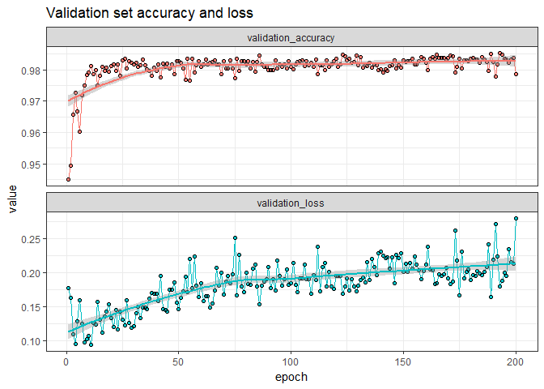
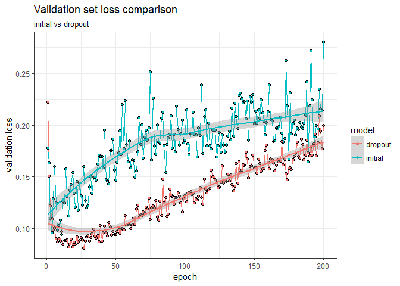
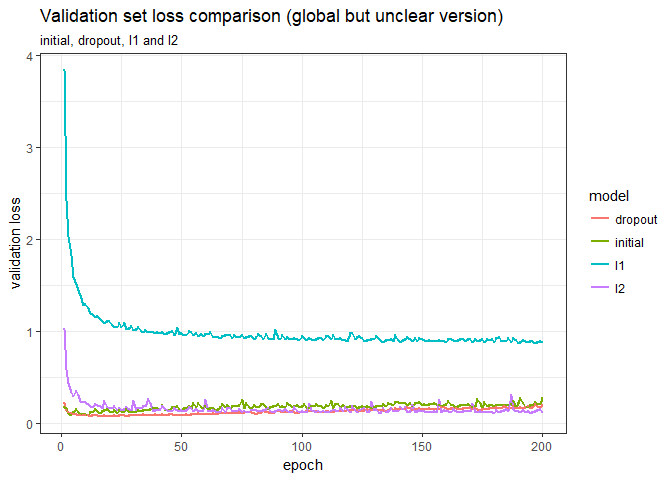
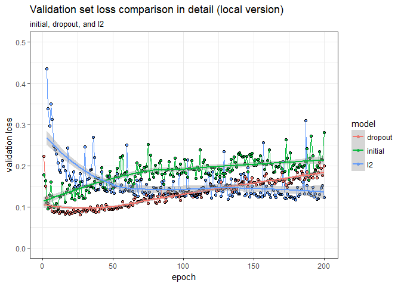

Part I
================
Kanyao Han

``` r
library(keras)
library(modelr)
library(tidyverse)
library(knitr)
```

Part I
------

### Preprocessing and Spliting

``` r
set.seed(1234)

mnist <- dataset_mnist()

# Process the initial training and test datasets
## training dataset
images <- array_reshape(mnist$train$x, c(60000, 28 * 28))
images <- images / 255
labels <- to_categorical(mnist$train$y)
## test dataset
test_images <- array_reshape(mnist$test$x, c(10000, 28 * 28))
test_images <- test_images / 255
test_labels <- to_categorical(mnist$test$y)

# Create partition index
index <- resample_partition(data.frame(images), 
                            c(test = 0.16667, train = 1- 0.16667))

# Split the training data into training and validation obs.
train_images <- images[index$train$idx,]
val_images <- images[index$test$idx,]
train_labels <- labels[index$train$idx,]
val_labels <- labels[index$test$idx,]
```

### Initial test

``` r
set.seed(1234)

network1 <- keras_model_sequential() %>%
  layer_dense(units = 512, activation = "relu", 
              input_shape = c(28*28)) %>%
  layer_dense(units = 512, activation = "relu") %>%
  layer_dense(units = 512, activation = "relu") %>%
  layer_dense(units = 512, activation = "relu") %>%
  layer_dense(units = 10, activation = "softmax")

network1 %>% 
  compile(
  optimizer = "rmsprop",
  loss = "categorical_crossentropy",
  metrics = c("accuracy")
  )

history1 <- network1 %>%
  fit(
    train_images,
    train_labels,
    epochs = 200,
    batch_size = 512,
    validation_data = list(val_images, val_labels)
  )
```

``` r
cbind(history1$metrics$val_loss, 
      history1$metrics$val_acc, 1:200) %>%
  data.frame() %>%
  rename("validation_loss" = X1, "validation_accuracy" = X2) %>%
  gather(1:2, key = Type, value = value) %>%
  ggplot(aes(X3, value, color = Type)) +
  geom_line(show.legend = FALSE) +
  geom_point(show.legend = FALSE, shape = 19) +
  geom_point(show.legend = FALSE, shape = 1, color = "black") +
  geom_smooth(show.legend = FALSE) +
  facet_wrap(~Type, scale = "free_y", ncol = 1) +
  theme_bw() +
  labs(title = "Validation set accuracy and loss",
       x = "epoch")
```



The validaton set loss achieve its lowest value at around epoch 11 and then degrades. It is also worth noting that the validaton set accuracy has a different trend because it still very slightly improving (generally flat) after epoch 25 and its higest point is at epoch 193. Considering that the dataset does not have the balanced class (only 10% of response are 1 and others are 0), the single validation accuracy is often not a good criteria for evaluation. **Therefore, according to the combination of validation loss and accuracy, I choose epoch 11 as the degrading point.**

### Dropout

``` r
set.seed(1234)

network2 <- keras_model_sequential() %>%
layer_dense(units = 512, activation = "relu", input_shape = c(28*28)) %>%
  layer_dropout(rate = 0.5) %>%
  layer_dense(units = 512, activation = "relu") %>%
  layer_dropout(rate = 0.5) %>%
  layer_dense(units = 512, activation = "relu") %>%
  layer_dropout(rate = 0.5) %>%
  layer_dense(units = 512, activation = "relu") %>%
  layer_dropout(rate = 0.5) %>%
  layer_dense(units = 10, activation = "softmax")

network2 %>% 
  compile(
  optimizer = "rmsprop",
  loss = "categorical_crossentropy",
  metrics = c("accuracy")
  )

history2 <- network2 %>%
  fit(
    train_images,
    train_labels,
    epochs = 200,
    batch_size = 512,
    validation_data = list(val_images, val_labels)
  )
```

``` r
cbind(history1$metrics$val_loss, 
      history2$metrics$val_loss,
      1:200) %>%
  data.frame() %>%
  rename("initial" = X1, "dropout" = X2) %>%
  gather(1:2, key = model, value = value) %>%
  ggplot(aes(X3, value, color = model)) +
  geom_line() +
  geom_point(shape = 19) +
  geom_point(shape = 1, color = "black") +
  geom_smooth() +
  theme_bw() +
  labs(title = "Validation set loss comparison",
       subtitle = "initial vs dropout",
       x = "epoch",
       y = "validation loss")
```



The new model performs better in most epochs, and the lowest validation loss is also in the new model.

### Regularization

#### l1

``` r
set.seed(1234)

network3 <- keras_model_sequential() %>%
  layer_dense(units = 512, activation = "relu", 
              kernel_regularizer = regularizer_l1(0.001), 
              input_shape = c(28*28)) %>%
  layer_dense(units = 512, activation = "relu", 
              kernel_regularizer = regularizer_l1(0.001)) %>%
  layer_dense(units = 512, activation = "relu", 
              kernel_regularizer = regularizer_l1(0.001)) %>%
  layer_dense(units = 512, activation = "relu", 
              kernel_regularizer = regularizer_l1(0.001)) %>%
  layer_dense(units = 10, activation = "softmax")

network3 %>% 
  compile(
  optimizer = "rmsprop",
  loss = "categorical_crossentropy",
  metrics = c("accuracy")
  )

history3 <- network3 %>%
  fit(
    train_images,
    train_labels,
    epochs = 200,
    batch_size = 512,
    validation_data = list(val_images, val_labels)
  )
```

#### l2

``` r
set.seed(1234)

network4 <- keras_model_sequential() %>%
  layer_dense(units = 512, activation = "relu",
              kernel_regularizer = regularizer_l2(0.001), 
              input_shape = c(28*28)) %>%
  layer_dense(units = 512, activation = "relu", 
              kernel_regularizer = regularizer_l2(0.001)) %>%
  layer_dense(units = 512, activation = "relu", 
              kernel_regularizer = regularizer_l2(0.001)) %>%
  layer_dense(units = 512, activation = "relu", 
              kernel_regularizer = regularizer_l2(0.001)) %>%
  layer_dense(units = 10, activation = "softmax")

network4 %>% 
  compile(
  optimizer = "rmsprop",
  loss = "categorical_crossentropy",
  metrics = c("accuracy")
  )

history4 <- network4 %>%
  fit(
    train_images,
    train_labels,
    epochs = 200,
    batch_size = 512,
    validation_data = list(val_images, val_labels)
  )
```

#### Comparsion

``` r
comparison <- data.frame(cbind(history1$metrics$val_loss, 
                                history2$metrics$val_loss, 
                                history3$metrics$val_loss, 
                                history4$metrics$val_loss, 
                                1:200)) %>%
  rename("initial" = X1, "dropout" = X2,
         "l1" = X3, "l2" = X4) %>%
  gather(1:4, key = model, value = value)
  
ggplot(comparison, aes(X5, value, color = model)) +
  geom_line() +
  geom_point(shape = 19) +
  geom_point(shape = 1, color = "black") +
  geom_smooth() +
  theme_bw() +
  labs(title = "Validation set loss comparison",
       subtitle = "initial, dropout, l1 and l2",
       x = "epoch",
       y = "validation loss")
```



``` r
comparison %>%
  filter(model != "l1") %>%
  ggplot(aes(X5, value, color = model)) +
  geom_line() +
  geom_point(shape = 19) +
  geom_point(shape = 1, color = "black") +
  geom_smooth() +
  theme_bw() +
  labs(title = "Validation set loss comparison in detail",
       subtitle = "initial, dropout, and l2",
       x = "epoch",
       y = "validation loss") +
  ylim(0, 0.5)
```



According to the two graphs, **the dropout model perfoms the best** and the l1 regulization model performs **much worse** than the other three models.

### Final model

``` r
min_val_loss <- data.frame(history2$metrics$val_loss, 1:200) %>%
  arrange(history2.metrics.val_loss) %>%
  slice(1) %>%
  rename("Optimal epoch" = X1.200)
min_val_loss[,2]
```

    ## # A tibble: 1 x 1
    ##   `Optimal epoch`
    ##             <int>
    ## 1              27

``` r
set.seed(1234)
# test the final model
network2 %>% fit(images, labels, epochs = 27, batch_size = 512)
results <- network %>% evaluate(test_images, test_labels)
```

``` r
results
```

    ## $loss
    ## [1] 0.0751803
    ## 
    ## $acc
    ## [1] 0.9828

The validation loss is very similar to that in the textbook and the validation accuracy is slightly higher than that in the textbook.
